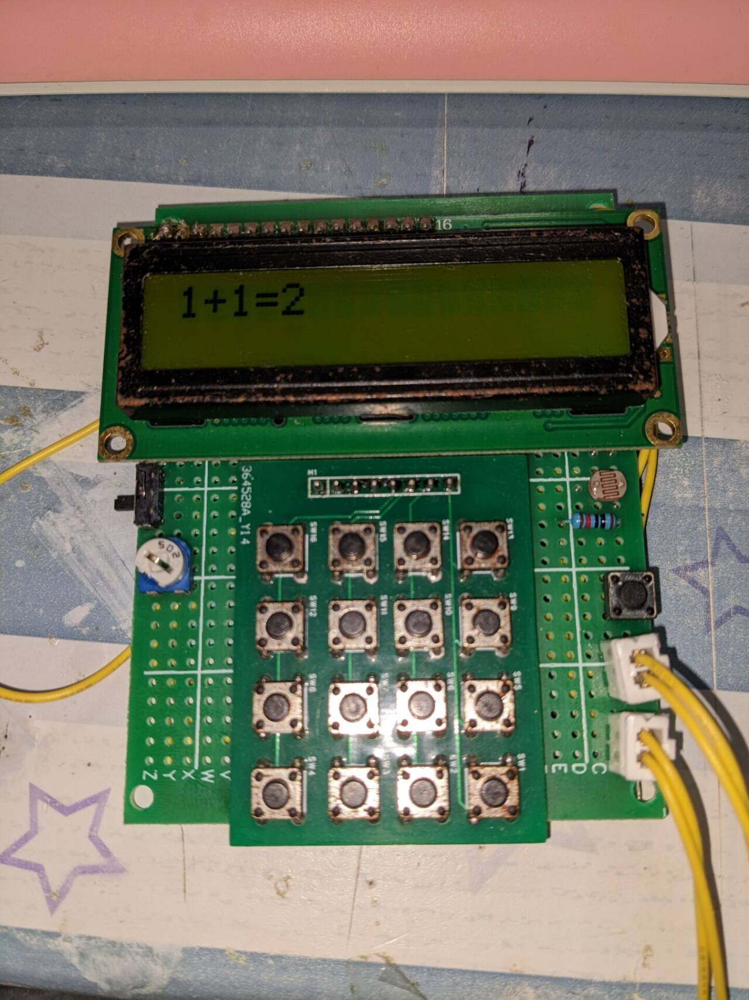
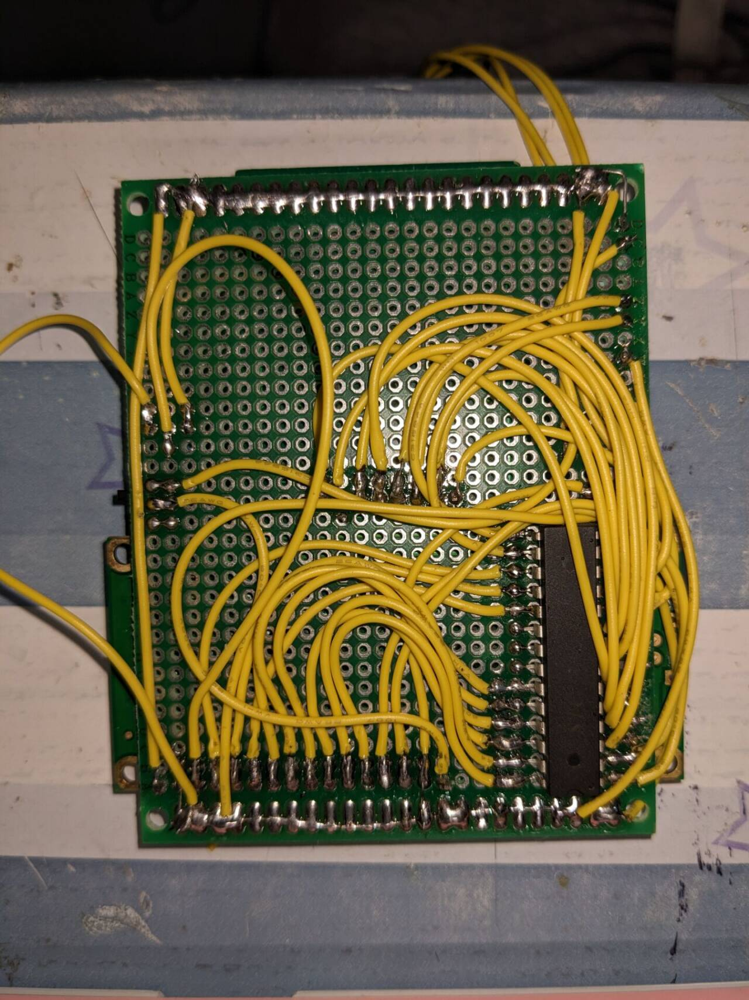

<!--
 * @Author: 2353919304@qq.com
 * @Date: 2024-09-27 21:31:04
 * @LastEditors: 2353919304@qq.com
 * @LastEditTime: 2024-09-27 21:45:43
 * @FilePath: \Calc\README.md
 * @Description: README
 * 
 * Copyright (c) 2024 by ${git_name_email}, All Rights Reserved. 
-->
# Calc V0.1.6
## 开发相关人员
+ 主要开发者[foxbrokenleaf](https://github.com/foxbrokenleaf)
+ V1.0.0更新思路共同探讨者[yuese3164](https://github.com/yuese3164)
## 开发环境
+ 操作系统:Windows 11 Homes 23H2
+ 编译器:Keil C51
+ 开发工具:Visual Studio Code + EIDE
+ 烧入工具:CH340
## 使用器件
+ MCU芯片：STC15W408AS-DIP28
+ 显示:LCD1602 5V 黄绿屏
+ 输入:轻触按键*16（矩阵键盘）
+ 背光控制:光敏电阻 + 10kΩ
+ LCD1602对比度：5KΩ电位器
+ 洞洞板
## 电路图
待上传
## 实物图
实物图正面

实物图背面

